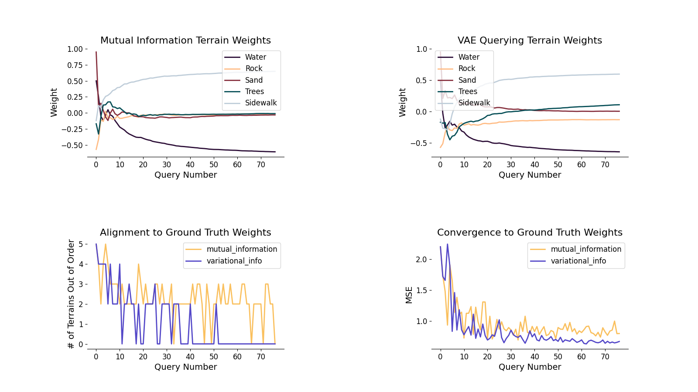
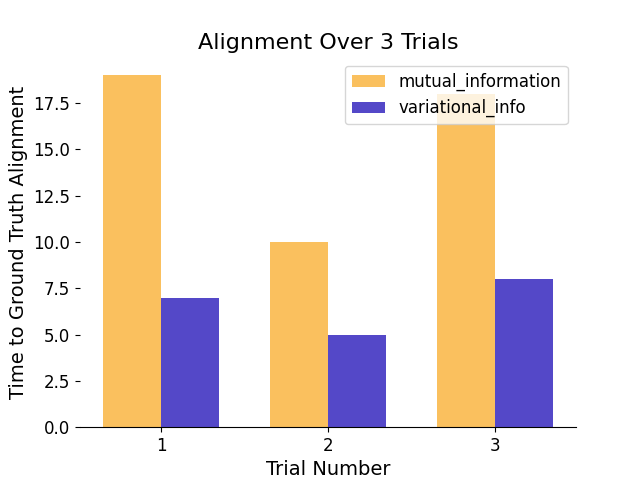
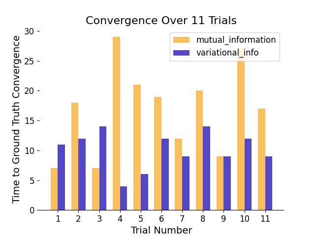

# VAE-based Terrain Preference-Learning Over Pairwise Trajectory Queries

Many navigational problems in robotics necessitate a well defined cost map related to the environment. Traditional techniques in creating these involve manual specification of terrain costs based on some context known to the human. However, this becomes intractable with large numbers of terrain types. Preference learning offers a unique way of tackling this type of problem by inferring a reward function through trajectory queries. However, offline preference learning suffers from the variability of the initial dataset, which limits the amount of information that can be gained from query responses and introduces a higher degree of cognitive burden on the human. In this paper, we propose to utilize recent advancements in preference learning surrounding the use of generative models, specifically variational autoencoders, as they utilize a lower dimensional latent space useful for clustering and inferring similarity or dissimilarity, to combat analogous or insufficient trajectory sets towards robotic navigation through learned terrain weights.

## Initial Results

